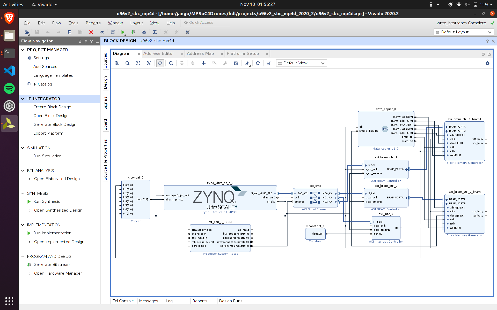

# Install dependencies

## Vivado `data_copier` block
Vivado `data_copier` block code is in `thresh_data_copier.vhd` file.



## Vitis code
Add `mem_copy_test.c` to the hello world example project instead of `hello_world.c`. Connect the board in JTAG boot mode via JTAG-USB converter to your computer, and then build and run the program on the board.

Use:
```bash
sudo screen /dev/ttyUSB1 115200
```
to watch the results of the code.

## Linux C code
Add `frame_changer.cpp` and `hardware_checker.cpp` to the working directory.

To add the BRAM driver to the project, use:
```bash
git submodule update --init --recursive
```

Install packages to show iamges in the terminal:
```bash
echo 'deb [trusted=yes] https://apt.fury.io/ascii-image-converter/ /' | sudo tee /etc/apt/sources.list.d/ascii-image-converter.list
sudo apt update
sudo apt install -y ascii-image-converter
```

Build project with:
```bash
bash build.sh
```

Connect a camera, and run the program with:
```bash
./frame_changer
```
